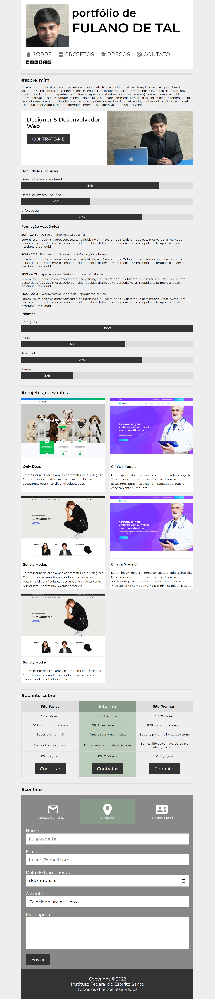
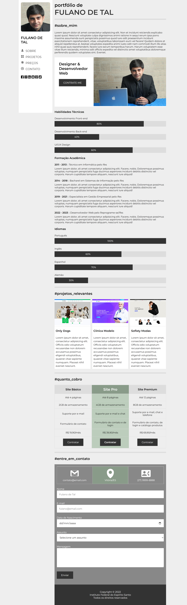

# Atividade Prática da Semana 3  

Na atividade prática da semana 3, você finalizou a criação de um site de portfólio do tipo *página única*! Na atividade da semana 4, o foco será na responsividade. Você está recebendo o código-fonte do site de portfólio pessoal com responsividade semiacabado. Assim como na semana anterior, sua tarefa será concluí-lo. Sua primeira tarefa é transferir os seus dados pessoais para esse site, conforme fez na tarefa anterior, substituindo os conteúdos pessoais fictícios. Em seguida, você deverá abrir o arquivo "estilos.css" e completar os seletores CSS nos trechos comentados usando as proprieades adequadas para o que é pedido.

Para começar, selecione o arquivo "index.html" e clique no botão "Run" no cabeçalho para visualizar a renderização da página no navegador incorporado do Repl.it. Depois disso, insira seus dados pessoais e em seguida selecione o arquivo "estilos.css" para comece a trabalhar nele. Enquanto estiver fazendo as alterações no código CSS, você pode pressionar "Ctrl+S" para aplicá-las à visualização do arquivo "index.html". Faça isso a cada alteração e observe o impacto causado. Isso te ajudará a compreender a utilidade de cada uma das propriedades CSS que estão sendo trabalhadas. Para concluir, não deixe também de assistir ao vídeo de apresentação dessa atividade, pois ele tem dicas valiosas. A figura abaixo mostra duas visões da versão responsiva do site já concluído. Bons estudos!

## Site Pronto em Tela Estreita ( <= 1280px de largura )

## Site Pronto em Tela Larga

